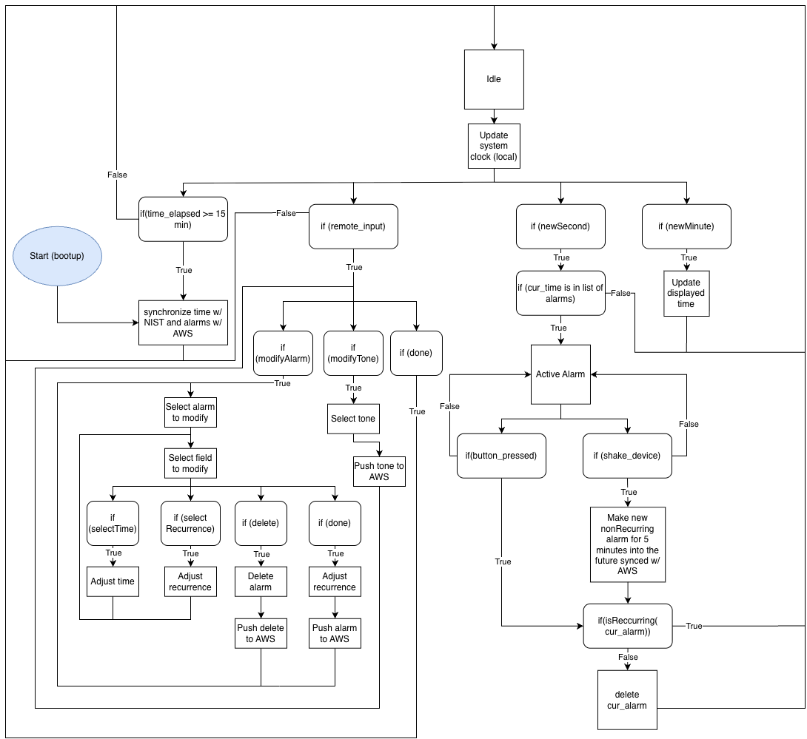
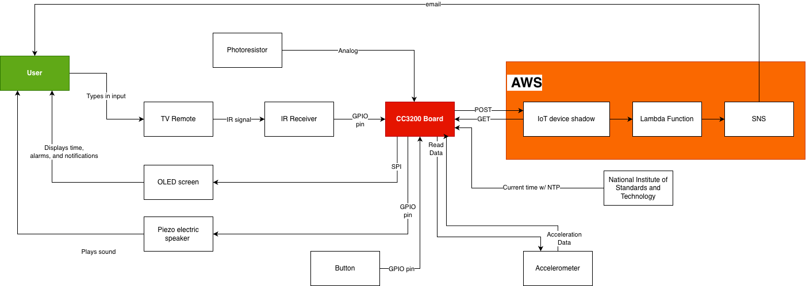
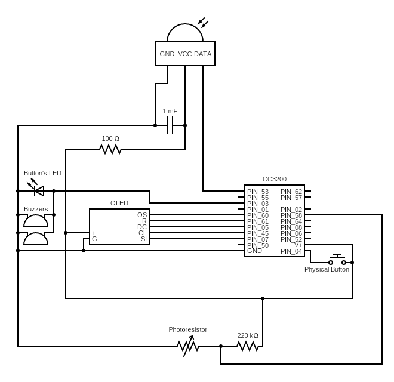

## William Barber and Mihail Marinov
### EEC 172 Winter 2026

## Overview

Dreamo is an internet-enabled alarm clock featuring automatic synchronization and convenient features for a seameless experience. Supporting multiple alarms, each individually configurable with distinct recurrence options, Dreamo can easily fit your schedule. Three alarm tone options provide you customization for the sound you would like to start your day, and automatic screen brightness ensures that you get a good night's sleep the night before. When an alarm sounds, the screen switches to maximum brightness, and a light embedded in the switch flashes repeatedly, ensuring that you don't oversleep. If you're ready to go, press the large, convenient button on the top. If you'd rather sleep in just a few minutes more, simply give the alarm a gentle bump, and the alarm will be temporarily rescheduled for five minutes into the future. If Dreamo becomes unplugged, your settings and alarms will be automatically restored once it is powered on through the cloud. No need to worry about setting the time either: Dreamo automatically synchronizes time from the Internet on startup, and resynchs every 15 minutes for optimal precision.

## Features
- Internet-enabled
  - Synchronizes time automatically
  - Alarms and tone selection synchronized to the cloud
- Configurable alarm sound
  - 3 tone options
- Flashing light and screen for visual alarm cue
- Press to dismiss, bump to snooze
- Multiple alarms supported
  - Configurable recurrence per alarm: once, daily, weekdays, or weekends
- Automatic brightness
  - Brightness of screen matches that of environment

## Detailed Description

### Design Overview

Figure 1: Functional Specification Diagram

Upon bootup, the device initiates a start sequence, pulling the current time from NIST and downloading the user's saved alarms from AWS. Once it is up and running, the device relies on a local system clock to keep time, and updates the device's visible display at the start of every new second. To ensure long-term precision and mitigate clock drift, the device re-synchronizes with both NIST and AWS every 15 minutes.

When remote input is detected, users can manage their alarms by creating a new one or modifying an existing one. They can adjust the exact alarm time, change the recurrence schedule for repeating days, or delete an unwanted alarm. They can also adjust the clock's tone, selecting from one of three options. Whenever a user makes these changes, the data is immediately pushed back to AWS to ensure the cloud database accurately reflects the device's current state.

The device checks its list of alarms every minute, immediately entering an "Active Alarm" state when the current time matches a saved alarm. When the alarm sounds, the user has two interaction choices: pressing a physical button or bumping the device. 

Pressing the button serves as a standard dismissal. Alternatively, bumping the device acts as a snooze function. This action immediately generates a new, non-recurring alarm set for five minutes in the future, which is synced with AWS, like a normal alarm. After either actions, if the alarm is not recurring (meaning that it is a once-off alarm), it is deleted, which is also reflected in the device shadow.

Figure 2: System Architecture Diagram

As shown in Figure 2, the System Architecture Diagram, the backbone of this device is a CC3200 microcontroller, which aggregates data from sensors, manages output devices, and synchronizing with the network via Wi-Fi. It also carries out necessary computations and keeps track of the time with its local clock.  

The system collects user input through several physical interfaces. An IR receiver is used so that the user can interact with the alarm clock's menus through a TV Remote. A physical button on the clock is used for dismissing alarms. Both the IR Receiver and button transmit their data to the CC3200 board through GPIO pins, which is then decoded in software. An accelerometer which collects physical movement data is used to detect bumps, which is communicated through I2C. A photoresistor is used to meaure the amient brightness level around the device, which is translated into digital data through the board's inbuilt ADC and then used to gradually dim its display as the surroundings get darker.

The device provides information to the user mostly through an OLED Screen, which the board communicates with over SPI. When an alarm is triggered, a pair of piezo-electric speakers get activated along with LEDs inside the physical button, all through digital GPIO output pins.

When the device is powered on, it fetches the current time from the National Institute of Standards and Technology using Network Time Protocol (NTP), and additionally fetches the previously created alarms and chosen ringtone from its AWS IoT device shadow through HTTP GET requests. When an alarm is created, modified, or deleted, the device shadow is updated through HTTP POST. When an alarm is triggered the device shadow's ``message" field is updated, activating a Lambda function which passes along the update to AWS SNS, which in turn sends an email notification to the user.

### Implementation

For this project, the pinmux configuration must include: `UART0` enabled, SPI enabled, `PIN_53` as input GPIO for the IR receiver, `PIN_05`, `PIN_61`, and `PIN_60` as GPIO output to be the OLED's `DC`, `R`, and `OS`, respectively. Additionally, I2C must be enabled, `PIN_58` must be configured as `ADC0`, `PIN_4` as an input pin for the push button, and `PIN_3` as an output pin for the electric speakers.

The peripherals must be configured as shown in Figure 3, the circuit schematic. The dismiss button has an integrated LED light, and as such is added in parallel with the buzzers so that it lights up when the alarm is triggered.

When running the project, it is important that the `J2` and `J3` pins are shorted when using the accelerometer. Additionally, `J4` needs to left unbridged, and the SOP2 pin should be bridged or unbridged depending on whether the board is flashed or running in debug mode.

Figure 3: Circuit Diagram

The project is based on the imported `aws-rest-api-ssl-demo`, used in Lab 4 and found in `lab4-blank.zip` in the class Canvas. The codebase is built on top of the existing AWS framework, and extended for synchronizing alarm and tone states. The certificates from Lab 4 can be reused as long as they are uploaded into the CC3200 board.

The overall machine runs as a state machine, with `START`, `SYNCH_TIME_AND_ALARMS`, `IDLE`, `ACTIVE`, and `REMOTE_INPUT` states. Before entering the state machine, the program initializes the hardware and creates local variables such as `currentState` and `nextState`, the `AlarmList`, current time, and others. After this, the code is simply a switch statement in an infinite loop, setting `currentState` to `nextState` and then switching on `currentState`. In the `START` state, we simply initialize the connection and then proceed to the `SYNCH_TIME_AND_ALARMS` state. The `START` state initially also initialized the hardware, but we found that the program didn't run properly when flashed into ROM unless the hardware initialization and `InitTerm()` was added to the top of the program before we entered the work loop. In the `SYNCH_TIME_AND_ALARMS` state, we synchronize the network time from the NIST, update the local system clock time to match, synchronize alarms from AWS, and then calculate the next alarm (to display on the bottom of the screen). After this we enter the `IDLE` state, where the program spends most of its time. Here it updates the system time every cycle, then checks if a new second has ticked over; if so, it updates the time displayed on the OLED. It then checks if the program has checked for an active alarm this minute yet or not. If it hasn't, it checks if an alarm should trigger, and if so, posts to AWS that an alarm has triggered, inverts the screen, and proceeds to the `ACTIVE` state. Otherwise, it checks if any input has arrived from the remote control (proceeding to `REMOTE_INPUT` if so) and then if a 15 minutes have passed, indicating the need to resync again (proceeding back to `SYNCH_TIME_AND_ALARMS` if so). In the `ACTIVE` state the program sounds the buzzer until it is either dismissed or snoozed. If it is dismissed then it checks if the alarm was set to go off `ONCE` or whether it was recurring (`DAILY`, `WEEKENDS`, or `WEEKDAYS`). If it was non-recurring, it deletes it locally and from the cloud. It then clears the screen, updates which alarm will sound next, and returns to the `IDLE` state. If an alarm is dismissed, a similar procedure is performed, except that a new `ONCE` alarm is addeed for five minutes in the future. Finally, the `REMOTE_INPUT` state enters the settings menu state machine (described in detail later), updates the next alarm, then returns to `IDLE`.

Updating to the cloud requires both HTTP POST and GET requests. Using the `http_post`, we added a helper function that allows POSTing the following string: `{"state": {"desired": {"\%d": {"hour": %lu, "minute": %lu, "type": %d}}}}`

We created similar helper functions to wipe the desired state by setting it to `null`, and that can delete alarms by setting their `id` to `null`.

A final POST helper function is needed to send: `{"state": {"desired": {"%s": "%s"}}}` The first string is set to either tone or message, depending on if whether the program is updating a setting or pushing an email when an alarm is triggered. 

Building on top of the `http_get`, we implemented a parser that looks for integer fields under "desired" that define hour, minute, and type. After receiving the GET, we call the wipe function to avoid duplicating alarms. When valid alarms are found, we use the alarm framework to create a new alarm and POST them again, refreshing the `id`s stored in AWS.

The final network protocol we implemented is NTP. We open a UDP socket with an working NIST IP on Port 123. To implement this correctly, we first imported `get_time` from the SDK, got it running as its own project, and then copied over the necessary code into the exisiting project.

As the project is centered around alarms and alarm scheduling, we implemented a number of structs and functions to abstract the process of managing alarms. An `AlarmList` consists of a list of `Alarm` pointers, a length, and a `nextId` integer. Alarms are often accessed by their `id`s, so to keep them unique, every time an alarm is added to an `AlarmList` through the `addAlarm()` function, the `nextId` field is incremented. An `Alarm` consists of an `id` integer (as described), a `Time`, and an `AlarmType`. A `Time` is simply an hour/minute pairing (`Alarms` do not have a "seconds" field), and `AlarmType` is an enum with the possible recurrence options: `ONCE`, `DAILY`, `WEEKDAYS`, or `WEEKENDS`.

AlarmLists have a number of useful functions, including the `anAlarmShouldTrigger()` and `nextAlarm()` functions. The former checks the full list of `Alarms` and checks whether the trigger conditions of that `Alarm` match (i.e. the date and time match the current date and time), and if so, returns the id of the first matching `Alarm`. This is used to determine when we should sound the alarm, and then to delete the `Alarm` afterwards if needed using the returned `id`. The latter calculates which of the `Alarm`s is next scheduled to trigger and returns its `id`. This is displayed on the bottom corner of the screen when on the home screen. To support these functions there are also a number of helper functions, including those to create and delete `Alarm`s and `AlarmList`s, to remove `Alarm`s from an `AlarmList`, to check if an individual Alarm should trigger, and more.

When an alarm should trigger, we need to sound the buzzer periodically in the classic on-off fashion of digital alarm clocks. We didn't want to freeze the clock while the alarm was sounding, as this could make dismissing the alarm cumbersome. For example, if a user dismissed the alarm right as the next tone sounded, it would not stop beeping until that tone was finished. We therefore developed a mostly non-blocking way of sounding the alarm. When an alarm should sound, a function `buzz()` is called repeatedly: this checks the current time, and performs a bitwise AND with one of the digits of the time. If that bit is set, then `buzzTick()` is called. This function sets the buzzer pin high, waits a very brief interval, sets it low, and then waits for that same interval again. This small delay (on the order of 0.5 milliseconds) allows for the tone of the buzzer to be customized: a longer delay results in a lower pitch, while a shorter delay results in a higher pitch. Back in the `buzz()` function, if the bit was not set, the buzzer pin is simply set low. By buzzing based on a single bit of the system time integer, the buzzer can sound for half the time. If we wanted a longer or shorter tone interval, we could accomplish this by simply moving the bit we compare higher or lower in the integer. Because the `buzzTick()` function is so fast, checks for alarm dismissal can happen very rapidly and crucially can take place while the alarm is actively buzzing, not just between buzzes.

To use the accelerometer, much of the data collection is similar to lab 2, where to collect data, we copied functions from the SDK’s `i2c_demo`. Unlike lab 2 however, we need z axis data alongside our x and y axis data. The issue is that registers `0x3`, `0x5`, and `0x7` store the position along the x, y, and z axes respectively, and to detect a snooze, we need their velocity rather than position. For this reason, we need to store our previous reading so that we can calculate the delta for each axis. This means that our first call of `detectSnooze()` should always return `false`, as it has no previous data to use. We will reset this before every alarm trigger, to avoid automatically snoozing when moving the clock between different alarms. After we have computed our 3 axis deltas, we should add them up and determine a threshold value. For us, `100` seemed to be perfect. So when an alarm is triggered, we clear the previously collected accelerometer positions, and we repeatedly poll our `detectSnooze()` function alongside our other alarm detections to see if the user will bump the clock.

For decoding the remote, we started by copying the code used for Lab 3. We were able to remove significant chunks of it, as buttons are interpreted as their integer values and we therefore didn't need the functionality of cycling through characters. We also moved some of the logic of decoding the signal into the interrupt handler. While this is generally bad practice, it was necessary due to the variable delay caused by the state machine loop. By moving just the portion of the logic responsible for decoding an individual bit (the time-sensitive portion of the logic) we were able to consistently read the bits sent by the remote correctly, and then decode that into logical digits later in the `processCharInput()` function. If a full bitstring had not been read, then `processCharInput()` returned negative one rather than the appropriate character.

Every time the home screen time display is updated (i.e. once per second) we first check the current ambient brightness and pick a new display color with the `getDisplayBrightness()` function. This function is based on the SDK's ADC example, and reads the current voltage on the analog input pin we configured earlier. We picked a resistance value for the resistor in series with the photoresistor such that the voltage ranges from `0.001` to `1.4` volts, and we scale this voltage to an appropriate brightness value with the `voltageToBrightness()` function. This starts with a fully bright display with `0b11111` for red, green, and blue, and subtracts the voltage multiplied by `(31/1.6)` from each before packing them into an appropriately sized colour bitstring (which starts as `0x0000`). We use `31/1.6` as the multiplier so that the screen is not completely off in a dark room. This resultant colour is passed to our custom `print_time()` function, which displays the current time in large font in the middle of the display.

The settings menu is handled through a state machine, similarly to the overall system. A large switch statement loops infinitely until the function returns (when the user backs out of the menu). In each state, the function displays the matching menu (home, tones, alarms, alarm modification, time selection, or recurrence selection), gets an appropriate selection, clears the screen, and then sets the next state to match the selection the user has made. For example, if the user is on the home menu and wishes to adjust an alarm time, they start in the `HOME` state. By entering `2`, the state machine switches to the `ALARMS` state, which displays all the alarms configured for the device. Then, they select the alarm they wish to modify and move to the `MODIFY_ALARM` state. This displays the specific information for the selected alarm and prompts the user for which parameter (time or recurrence) the wish to modify, or if they want to delete the alarm. They then select time, which transitions the state machine to the `MODIFY_TIME` state. From here, the currently-selected time is displayed, and the user types in when they would like the alarm to sound. When they are done here, they return to the `MODIFY_ALARM` state, and can continue to modify the alarm or back further out through the menu system as they desire. Input validation occurs within the state the user is currently in, enforcing that only valid state transitions can occur.

## Demonstration

<video controls src="Demo_Video_Compressed.mp4" title="Dreamo Video Demonstration"></video>
