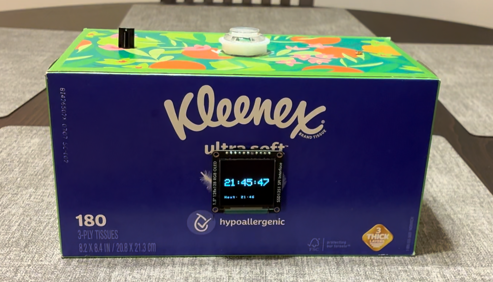

# Dreamo Alarm Clock

## William Barber and Mihail Marinov
### EEC 172 Winter 2026

## Overview

Dreamo is an internet-enabled alarm clock featuring automatic synchronization and convenient features for a seameless experience. Supporting multiple alarms, each individually configurable with distinct recurrence options, Dreamo can easily fit your schedule. Three alarm tone options provide you customization for the sound you would like to start your day, and automatic screen brightness ensures that you get a good night's sleep the night before. When an alarm sounds, the screen switches to maximum brightness, and a light embedded in the switch flashes repeatedly, ensuring that you don't oversleep. If you're ready to go, press the large, convenient button on the top. If you'd rather sleep in just a few minutes more, simply give the alarm a gentle bump, and the alarm will be temporarily rescheduled for five minutes into the future. If Dreamo becomes unplugged, your settings and alarms will be automatically restored once it is powered on through the cloud. No need to worry about setting the time either: Dreamo automatically synchronizes time from the Internet on startup, and resynchs every 15 minutes for optimal precision.

## Features
- Internet-enabled
  - Synchronizes time automatically
  - Alarms and tone selection synchronized to the cloud
- Configurable alarm sound
  - 3 tone options
- Flashing light and screen for visual alarm cue
- Press to dismiss, bump to snooze
- Multiple alarms supported
  - Configurable recurrence per alarm: once, daily, weekdays, or weekends
- Automatic brightness
  - Brightness of screen matches that of environment

## Detailed Description

- TODO (from report)

## Demonstration
<video controls src="Demo_Video_Compressed.mp4" title="Dreamo Video Demonstration"></video>